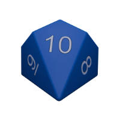

After having developed a fair amount of React both at work and in home projects
and I wanted to try out React Native.

I have taken courses from [Maximilian Schwarzmüller](https://www.udemy.com/user/maximilian-schwarzmuller/) in the past so I assumed his
React Native course would be high-quality as well: [React Native: The Practical Guide](https://www.udemy.com/course/react-native-the-practical-guide)

One technique I like to use when learning from a class is to make up my own
sample project that is different than the class project and apply each concept
learned.  This dice rolling app is my alternate project for Section 4 of the course.
Instead of a number-guessing game I developed this die roller app instead.

It is structured as two main screens (each developed as a fullscreen
React component):
* SelectScreen
* RollScreen

The user taps pictures of the die types they want to roll to select the
total dice selected.  Then after tapping a "Roll" button, the individual results
and their sum is displayed.

Although this is a very basic project it did teach me a few
basics:
* How to handle page navigation
* How to use Flexbox
* Differences between React and React Native
* And some Blender 3D modeling knowledge:
  - how to do UV unwrapping for the dice models

The code for the project is available here:
[github.com/johnharp/dice-mobile](https://github.com/johnharp/dice-mobile)

The Blender file for the die graphics is available here:
[dice.blend](assets/dice.blend)

The UV map used to apply the numbers on the die sides is:
[Number-Texture2.png](assets/Number-Texture2.png)

